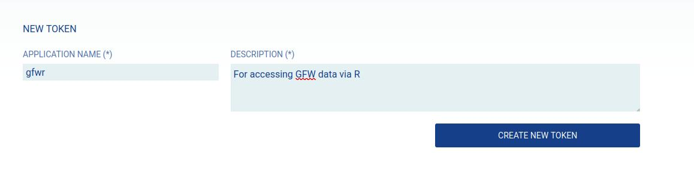

# Introduction to Global Fishing Watch data downloading and visualization in R

This workshop will provide you with an introduction to downloading and visualizing Global Fishing Watch data in R. Global Fishing Watch provides data on apparent fishing effort, vessel tracks and events, and more; see the [website](https://globalfishingwatch.org/) for details.

## Prerequisites

You will need the `terra`, `ggplot2`, and `usethis` packages installed. We will use the `gfwr` package to access Global Fishing Watch data. These packages can be installed using the following code:

```         
install.packages(c("terra", "ggplot2", "usethis", "remotes"))

remotes::install_github("GlobalFishingWatch/gfwr")
```

If you have used `gfwr` before, make sure you have the most recent version (`v2.0.1` at the time of writing).

If you have problems installing `terra`, there are more details about installing it [here](https://rspatial.github.io/terra/index.html).

### Global Fishing Watch API token

To access Global Fishing Watch data, you will need an API token stored on your computer. The token is like a code that you need to able to access the data. This is free, but you need to register for a [Global Fishing Watch account](https://gateway.api.globalfishingwatch.org/auth?client=gfw&callback=https%3A%2F%2Fglobalfishingwatch.org%2Four-apis%2Ftokens&locale=en&_gl=1*cxpc0o*_gcl_au*NTAwNjIxOTE5LjE3Mzc1MTkzMTY.*_ga*MTQxNzMzMDU2NC4xNzM3NTE5MzE2*_ga_5W83X3EYGW*MTczNzUxOTMxNi4xLjEuMTczNzUyMTEyMC42MC4wLjEwNjUwNzY1MjM.*_ga_M5J2ZHDZMV*MTczNzUxOTMxNi4xLjEuMTczNzUyMTEyNi42MC4wLjE1NjQ4Njc1NzU.) if you don't already have one. Then you can request an [API access token](https://globalfishingwatch.org/our-apis/tokens). Here is an example of how I filled in the details requested:



Once you have created the token, you need to copy it into your `.Renviron` file. You can do this by:

1.  Running `usethis::edit_r_environ()`, which should open you `.Renviron` file.
2.  Add the words `GFW_TOKEN="PASTE_YOUR_TOKEN_HERE"` to the file, replacing "PASTE_YOUR_TOKEN_HERE" with your API token. 
3.  Save the `.Renviron` file, and restart your R session, e.g. close and re-open RStudio.

That should be it. If you have any problems, drop me a line before the workshop and we will sort it out!

You will also need to have the data within this repository. You can do one of the following depending on how comfortable you are with Github:

-   [Fork this repository](https://github.com/jflowernet/intro-terra/fork). This will create your own copy of this repository which has all the data and code. More details on how to fork [here](https://docs.github.com/en/pull-requests/collaborating-with-pull-requests/working-with-forks/fork-a-repo)
-   Download the data to somewhere on your computer that you will be able to access during the workshop. The data are in a zip file [here](https://github.com/jflowernet/intro-terra/raw/main/data/data.zip). Once you have downloaded the data, unzip it, and make sure you know the path to the folder with all the data, e.g. "Documents/workshop_data/", so you can load the data during the workshop.

The workshop website link is on the right hand side of this page and can also be accessed [here](https://jflowernet.github.io/intro-terra/)
